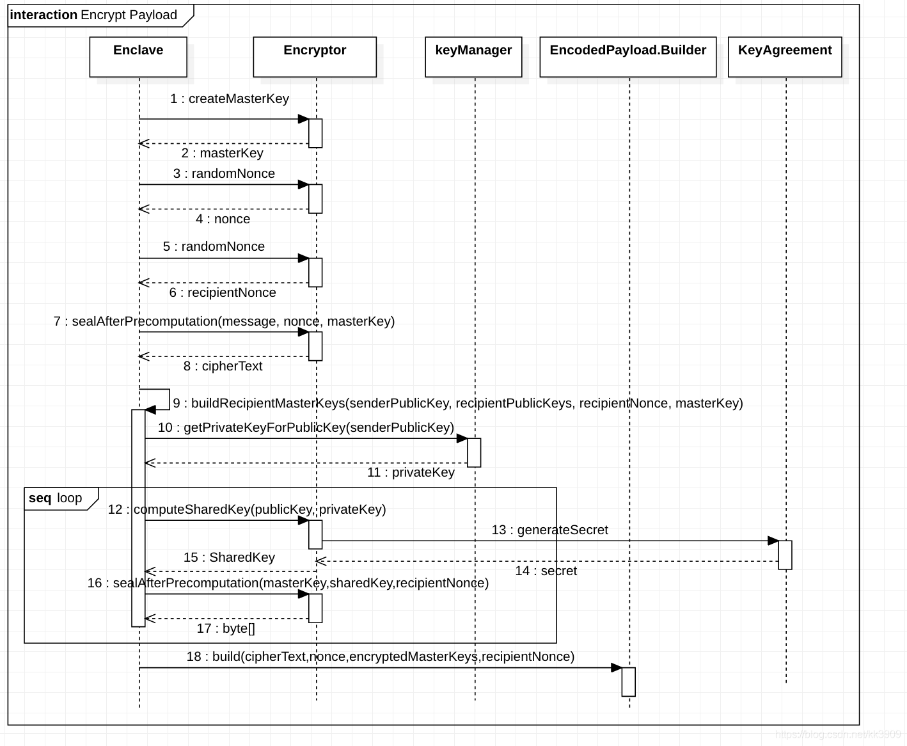
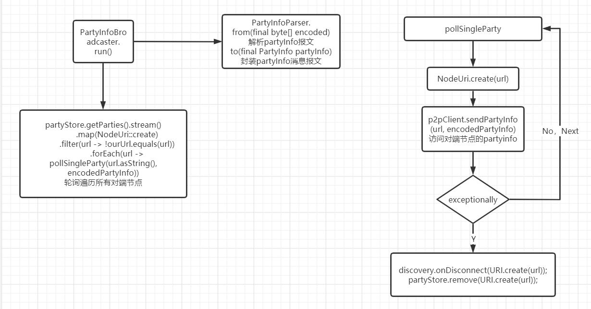
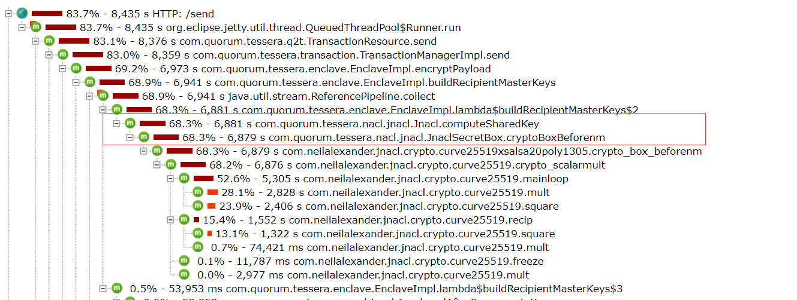
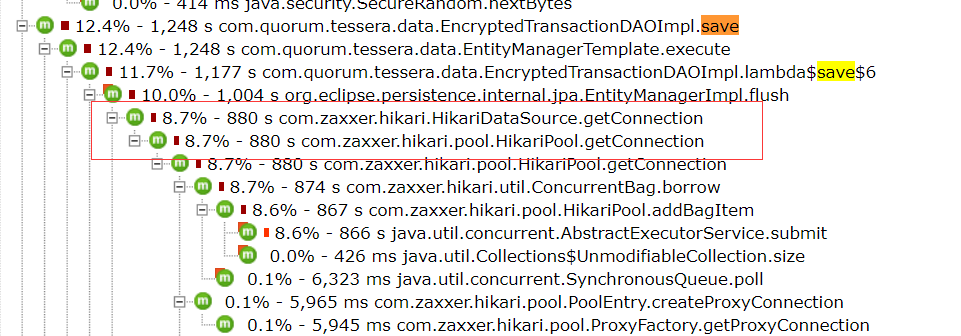

# Ptm Source code process analysis

## 1项目结构

```
├── argon2 hash函数库,类似的函数还有pbkdf2、bcrypt、 scrypt
├── cli 使用picocli实现的命令行tessera（包含子命令keygen|keyupdate|admin）
├── config 配置数据模型,给各个模块使用的配置
├── config-migration 提供命令行可以将Constellation TOML转换成Tessera JSON
├── data-migration 创建表结构
├── ddls ddl语句,包含两张表(支持mysq、oracle、postgresql、h2、hsql、sqllite)
├── enclave 提供加密、解密接口/Restful api(调用encryption模块)
├── encryption 生成主密钥、共享密钥、加密解密payload、生成随机数等.实现有ec、jnacl、kalium三种
├── key-generation 公钥私钥生成,包含aws、azure、hashcorp三种实现
├── key-vault 密钥保险箱 ,有aws、azure、hashcorp三种实现,可将密钥保存在这些在线服务上
├── security ssl通信相关工具
├── server 包含两个TesseraServer的实现:1、使用Jersey和Jetty 实现的RestServer;2 WebSocketServer
├── service-locator 获取服务实例,默认使用spring 配置文件 tessera-spring.xml中的定义(不使用注解?)
├── shared 大杂烩,包含一些工具类:控制台密码读取、ReflectCallback、JaxbCallback等CallBack
├── tessera-context 上下文,见下面的RuntimeContext
├── tessera-core 主要包含TransactionManager
├── tessera-data 主要包含EncryptedTransactionDAO、EncryptedRawTransactionDAO的实现
├── tessera-dist 系统launcher入口,包含tessera-spring.xml配置文件
├── tessera-jaxrs 系统RESTful API(OpenAPI)定义
├── tessera-partyinfo 参与者之间的服务发现、p2p连接、推送EncodedPayload到其他节点
├── tessera-recover recover and resend
├── test-utils 测试mock工具
└── tests 测试用例
```

## 2.数据库结构

```
CREATE TABLE ENCRYPTED_TRANSACTION (
ENCODED_PAYLOAD BLOB NOT NULL, 
HASH VARBINARY(100) NOT NULL, 
TIMESTAMP BIGINT, PRIMARY KEY (HASH)
);

CREATE TABLE ENCRYPTED_RAW_TRANSACTION (
ENCRYPTED_KEY BLOB NOT NULL,
ENCRYPTED_PAYLOAD BLOB NOT NULL,
NONCE BLOB NOT NULL,
SENDER BLOB NOT NULL, 
TIMESTAMP BIGINT, 
HASH VARBINARY(100) NOT NULL, PRIMARY KEY (HASH)
);
```

备注：

```
ptm支持三种加解密库
EC （Elliptic Curve Cryptography） 椭圆曲线算法
kalium （https://github.com/abstractj/kalium）
NACL Networking and Cryptography Library 默认使用该库
```

## 3服务启动流程

```
a. 首先通过cli从配置文件config.json读取配置，根据配置创建运行时上下文（上下文持有当前节点公私钥对，peers列表等引用）
b. 再将当前partyInfo保存到集合中(内存)
c. 根据的serverConfigs循环创建ThirdPartyRestApp、P2PRestApp、Q2TRestApp(未包含EnclaveApplication)Restful服务
d 启动服务监听
```


## 4交易流程

```
a.收到交易请求后，将请求交给TransactionManager处理，TransactionManager调用Enclave加密tx(详见【加密交易】)，根据加密的payload，调用MessageHashFactory生成tx Hash，
b. 调用DAO将数据保存到数据库
c. 循环接收者列表，将加密了的playload推送给其他ptm节点处理
d.将tx hash使用base64编码后返回给qlc节点
```


## 5加密交易

```
a. 生成随机主密钥（RMK：NonceMasterKey）和随机数Nonce、接收者随机数Nonce
b.使用步骤a的随机数Nonce和RMK加密message(Transaction Payload)。
c. 根据发送者的公钥从keymanager中获取发送者私钥
d.遍历接收者列表：根据发送者的私钥和接收者的公钥生成共享秘钥，根据共享密钥和接收者随机数加密RMK，最后返回RMK列表
e.返回加密的playload、随机数、RMKs给Transaction Manager
```




## 6.SendRaw处理流程

ptm隐私交易入口sendRaw


## 7.ptm 节点发现同步流程

### 7.1 tessera-partyinfo 

参与者之间的服务发现、p2p连接、推送EncodedPayload到其他节点，对应目录结构

```
├── discovery
│   ├── ActiveNode.java
│   ├── AutoDiscovery.java
│   ├── DefaultNetworkStore.java
│   ├── DisabledAutoDiscovery.java
│   ├── DiscoveryFactory.java
│   ├── DiscoveryHelperFactory.java
│   ├── DiscoveryHelperImpl.java
│   ├── DiscoveryHelper.java
│   ├── Discovery.java
│   ├── EnclaveKeySynchroniserFactory.java
│   ├── EnclaveKeySynchroniserImpl.java
│   ├── EnclaveKeySynchroniser.java
│   ├── NetworkStoreFactory.java
│   ├── NetworkStore.java
│   └── NodeUri.java
└── partyinfo
    ├── AutoDiscoveryDisabledException.java
    ├── node
    │   ├── NodeInfo.java
    │   ├── Recipient.java
    │   └── VersionInfo.java
    ├── P2pClientFactory.java
    ├── P2pClient.java
    ├── PartyInfoServiceUtil.java
    └── URLNormalizer.java
```

1.1 ActiveNode

```
Set<PublicKey> keys;  //节点公钥集合
NodeUri uri;      //class NodeUri.private final String value
Set<String> supportedVersions;
```

1.2 AutoDiscovery implements Discovery

1.3 DefaultNetworkStore implements NetworkStore

Set<ActiveNode> activeNodes = ConcurrentHashMap.newKeySet();

remove/store/get activeNodes

1.4 DisabledAutoDiscovery implements Discovery 

NetworkStore networkStore

Set<NodeUri> knownPeers

1.5 DiscoveryHelperImpl implements DiscoveryHelper

NodeInfo buildCurrent()

NodeInfo buildRemoteNodeInfo(PublicKey recipientKey)

Set<NodeInfo> buildRemoteNodeInfos()

1.6 interface NodeInfo

```
default Map<PublicKey, String>；   一个公钥和url的映射集合
Set<Recipient> getRecipients();   recipients 集合
recipients包含 
    private final PublicKey key;
    private final String url;
Set<String> supportedApiVersions();  string 集合
```

1.7 class Recipient

```
private final PublicKey key;
private final String url;
```

1.8 interface VersionInfo

```
Set<String> supportedApiVersions();
```

1.9 interface PartyInfoServiceUtil

boolean validateKeysToUrls(final NodeInfo existingPartyInfo, final NodeInfo newPartyInfo)

根据pubkey检验existingPartyInfo中对应url是否一致

### 7.2 tessera-jaxrs/partyinfo-model

```
model
    ├── NodeInfoUtil.java
    ├── PartyInfoBuilder.java
    ├── PartyInfo.java
    ├── Party.java
    └── Recipient.java
```

2.1 interface NodeInfoUtil

NodeInfo from(PartyInfo partyInfo, Collection<String> versions)

2.2 class Party

String url

get the Party, URL

2.3 class PartyInfo

```
String url;
Set<Recipient> recipients;
Set<Party> parties;
```

2.4 class PartyInfoBuilder

```
String uri;
Map<PublicKey, String> recipients
```

2.5 class Recipient

```
PublicKey key;
String url;
```

### 7.3 tessera-jaxrs/sync-jaxrs

```
 p2p
    ├── P2PRestApp.java
    ├── partyinfo
    │   ├── PartyInfoBroadcaster.java
    │   ├── PartyInfoParserException.java
    │   ├── PartyInfoParser.java
    │   ├── PartyStoreFactory.java
    │   ├── PartyStore.java
    │   ├── RestP2pClientFactory.java
    │   ├── RestP2pClient.java
    │   └── SimplePartyStore.java
    ├── PartyInfoResource.java
    ├── recovery
    │   ├── PushBatchRequest.java
    │   ├── RecoveryClientFactory.java
    │   ├── RecoveryClient.java
    │   ├── ResendBatchRequest.java
    │   ├── ResendBatchResponse.java
    │   ├── RestBatchTransactionRequesterFactory.java
    │   ├── RestBatchTransactionRequester.java
    │   ├── RestRecoveryClientFactory.java
    │   ├── RestRecoveryClient.java
    │   ├── RestResendBatchPublisherFactory.java
    │   └── RestResendBatchPublisher.java
    ├── RecoveryResource.java
    ├── resend
    │   ├── ResendClientFactory.java
    │   ├── ResendClient.java
    │   ├── ResendPartyStoreImpl.java
    │   ├── ResendPartyStore.java
    │   ├── ResendRequest.java
    │   ├── ResendRequestType.java
    │   ├── ResendResponse.java
    │   ├── RestResendClientFactory.java
    │   ├── RestResendClient.java
    │   ├── SyncableParty.java
    │   ├── SyncPoller.java
    │   ├── TransactionRequesterImpl.java
    │   └── TransactionRequester.java
    └── TransactionResource.java
```

3.1 class PartyInfoBroadcaster implements Runnable

```
Discovery discovery;
PartyInfoParser partyInfoParser;
P2pClient p2pClient;
Executor executor;
PartyStore partyStore;
```



3.2 interface PartyInfoParser extends BinaryEncoder

PartyInfo from(final byte[] encoded)

partyInfo 网络报文格式

```
long        urllength
urllength   url
long        numberOfRecipients
	0----numberOfRecipients
	long     				recipientKeyLength
	recipientKeyLength		recipientKey
	-----numberOfRecipients
long		partyCount
	0----partyCount
	long					partyElementLength
	partyElementLength		ptyData
	-----partyCount
```

3.3 interface PartyStore

Set<URI> parties

3.4 RestP2pClient implements P2pClient

实现sendPartyInfo

## 8.性能优化过程

### 8.1当前性能瓶颈分析

V1.4.2-bete1版本测试时，发现在并发账户到300之后，ptm节点cpu消耗到%700，继而影响到整个系统的tps不能超过300

使用JProfiler工具分析ptm节点的cpu打点数据

#### 8.1.1.send接口中computeShareKey处理



这个是在处理隐私数据时，遍历recipers，根据sender的prikey和对端的pubkey计算出一个sharedKey，然后用sharedKey加密数据

目前看是在计算sharedKey的时候最消耗cpu

#### 8.1.2.数据库处理中getConnection损耗



### 8.2性能优化思路

#### sharedKey计算处理增加缓存

实际场景中，联盟中可能就几个ptm节点，对应着sender和recipers的密钥对有限，不用每一次都重新计算sharedKey

可以根据预设配置，每一对sender_priKey+reciper_pubKey,每N次才重新计算一次shareKey

在测试环境47.103.54.171上（4核*2.5G CPU，8G mem）

优化前，单独打ptm节点性能大约在300左右，cpu被吃满

| Type | Name       | # requests | # failures | Median response time | Average response time | Min response time | Max response time | Average Content Size | Requests/s | Requests Failed/s |
| ---- | ---------- | ---------- | ---------- | -------------------- | --------------------- | ----------------- | ----------------- | -------------------- | ---------- | ----------------- |
| POST | /send      | 10623      | 0          | 4400                 | 4398                  | 15                | 11181             | 98                   | 300.6      | 0                 |
| None | Aggregated | 10623      | 0          | 4400                 | 4398                  | 15                | 11181             | 98                   | 300.6      |                   |

增加了一个全局sharedKey CacheMap之后

单独打ptm节点性能用jprofile查看单独ptm节点性能翻番，这个时候ptm还没有到cpu的峰值

| Type | Name       | # requests | # failures | Median response time | Average response time | Min response time | Max response time | Average Content Size | Requests/s |
| ---- | ---------- | ---------- | ---------- | -------------------- | --------------------- | ----------------- | ----------------- | -------------------- | ---------- |
| POST | /send      | 70267      | 0          | 1200                 | 1351                  | 6                 | 51920             | 98                   | 557.24     |
| None | Aggregated | 70267      | 0          | 1200                 | 1351                  | 6                 | 51920             | 98                   | 557.24     |

2020修改了locust测试脚本之后

受限于locust性能，测试机单核100%已经跑到了


tps能到643，

| Type | Name       | # requests | # failures | Median response time | Average response time | Min response time | Max response time | Average Content Size | Requests/s |
| ---- | ---------- | ---------- | ---------- | -------------------- | --------------------- | ----------------- | ----------------- | -------------------- | ---------- |
| POST | /send      | 57923      | 0          | 220                  | 852                   | 7                 | 23025             | 98                   | 643.23     |
| None | Aggregated | 57923      | 0          | 220                  | 852                   | 7                 | 23025             | 98                   | 643.23     |

这样就达到之前测试不带ptm的qlc节点处理性能，所以暂时系统吞吐性能瓶颈就不在ptm这侧了

实测结果

在V1.4.2-beta3版本集成性能测试中

在并发账号到600，整体系统tps打到580

ptm节点cpu消耗在150%左右

qlc节点cpu消耗在700%，所以新的性能瓶颈节点在qlc节点。


## 附1：重要的类结构说明

```
class TransactionManagerImpl implements TransactionManager
//传输控制实例类
这个里面实现了 send / receive / store 等接口
{
	private final PayloadEncoder payloadEncoder; //数据格式编码解码接口

    private final Base64Codec base64Codec;  //base64 编码

    private final EncryptedTransactionDAO encryptedTransactionDAO; //传输加密数据的存储

    private final EncryptedRawTransactionDAO encryptedRawTransactionDAO; //传输流加密数据的存储

    private final BatchPayloadPublisher batchPayloadPublisher; // publish数据的批量剥离

    private final PayloadPublisher payloadPublisher; // publish数据的剥离

    private final Enclave enclave;//数据加解密接口

    private final ResendManager resendManager; //重传管理

    private final PrivacyHelper privacyHelper; //隐私数据的验证
}


class EnclaveImpl implements Enclave
//数据加解密和密钥管理
{
	private final Encryptor encryptor; //数据加解密接口

    private final KeyManager keyManager;//密钥对管理
}
//重要的接口
encryptPayload() //数据加密
buildRecipientMasterKeys() //计算对称密钥
unencryptRawPayload() // 原始数据解密

class EncodedPayloadManagerImpl implements EncodedPayloadManager
//加密数据管理
{
    private final Enclave enclave;//数据加解密接口

    private final PrivacyHelper privacyHelper;//隐私数据的验证

    private final MessageHashFactory messageHashFactory; //文本hash接口
}
public EncodedPayload create(final SendRequest request) //根据请求生成加密数据
ReceiveResponse decrypt（） //根据hash查找加密数据，解密之后返回响应

public class ActiveNode 
//每个活跃节点对象
{
    private final Set<PublicKey> keys; //公钥集合
 
    private final NodeUri uri; //节点URL

    private final Set<String> supportedVersions; //支持的版本集合
}
```

## 附2：产品待定需求：

1.当前只有依赖hash查询隐私记录的接口，查询的业务逻辑都在qlc节点侧。

2.批量查询某个时间段的隐私交易记录（生成报表需求）

3.指定交易hash，删除记录的需求 ，这个原项目有对应issue（https://github.com/ConsenSys/tessera/issues/872）

4.一个ptm节点可以支持多组公私钥，对应多个qlc节点（性能可以支持，但是相关数据隔离，安全性需要考虑）

5.部署时自动生成密钥对，跳过手动生成的那一步（简化部署，但是密钥对的安全性和可保存性需要考虑）